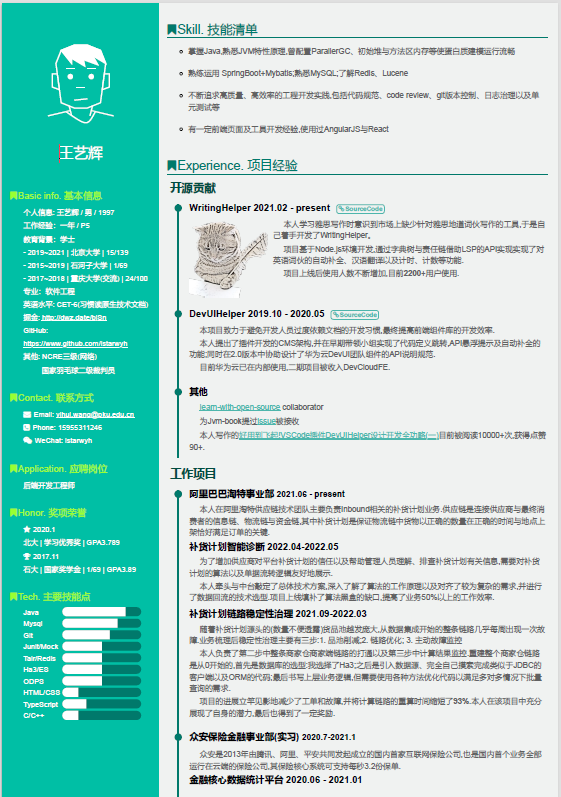

resume-it
======

一个灵活的数据模板分离的在线简历生成器,效果：https://istarwyh.github.io/resume-it/


## 风格参考
[](https://app.fossa.io/projects/git%2Bgithub.com%2Fxiao555%2Fresume-it?ref=badge_shield)

[@DIYgod](http://html.love/)

## Configuration

### 使用默认模板

这个默认模板是参考@[DIYgod](http://html.love/) 的，如果直接用的话只需要修改 `data.yaml` 里的数据即可。

1. YAML语法可以参考[这里](http://www.ruanyifeng.com/blog/2016/07/yaml.html)
2. 如果需要用到Markdowm语法，请在字段开头加上 `!!md `，相应的前端模板要渲染md的话请加上safe过滤：`{{ example | safe}}`

### 使用自定义模板

#### 1. HTML
html部分在`template/index.html`，这一部分是页面body的内容，采用[Nunjucks](https://mozilla.github.io/nunjucks/)模板引擎，如果需要修改head，请前往`template/base.html`.

注：写模板的时候请在必要的地方用一下判断，有的地方可能没有数据。

#### 2. CSS

css部分在`src/styles/stylus`, 默认用stylus写。

注：
1. 已经加载了font-awesome，可以直接用
2. 加载了autoprefixer插件自动补全前缀

#### 3. 其他文件

本项目使用gulp打包，如果要添加其他文件的话需要写一下配置文件`gulpfile.js`, 暂时没有提供打包其他文件的task

## Usage

### 安装依赖

```javascript
npm i
```

### Dev

```javascript
npm start
```
自动打开浏览器访问：`http://localhost:3000/`。 Browsersync 带热重载功能。

打印版: 首页最下面有个打印版链接 或者 访问 `http://localhost:3000/print.html`，直接打印即可，注意勾选背景图片

### Publish

1. 在`publish.ts` 里配好repo地址

2. 运行
```javascript
npm run publish
```
这样会将`dist` 目录下的文件都**强制**提交到`gh-pages`分支

3. 使用github的Pages 功能发布GitHub Pages静态页面
(借助`Deploy to GitHub Pages` extension 可直接发布静态页面)

## TODO

1. 多模板
2. 在线编辑+发布+导出
3. 增加对于技术栈标记Tag的功能

## 更新日志

2022.05.05

相比原项目,更改后的项目更适合社招同学.

2017.6.18
  调整结构，采用 Gulp 打包，public 用 `simple-git`, 不用shell脚本了

## LICENSE

MIT

[](https://app.fossa.io/projects/git%2Bgithub.com%2Fxiao555%2Fresume-it?ref=badge_large)